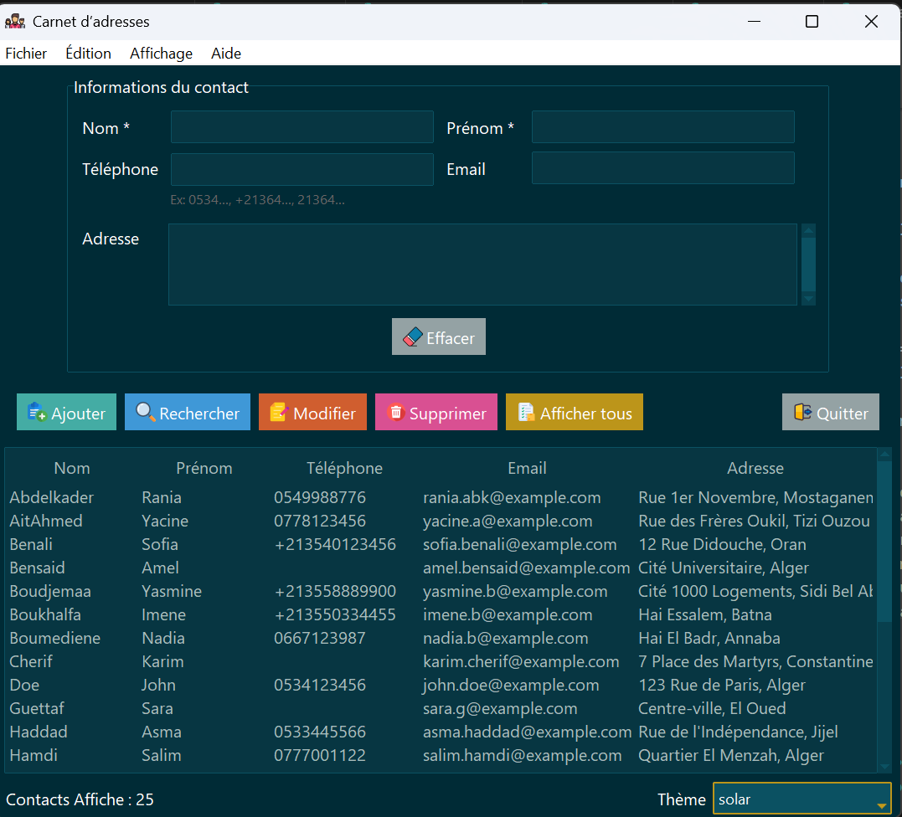
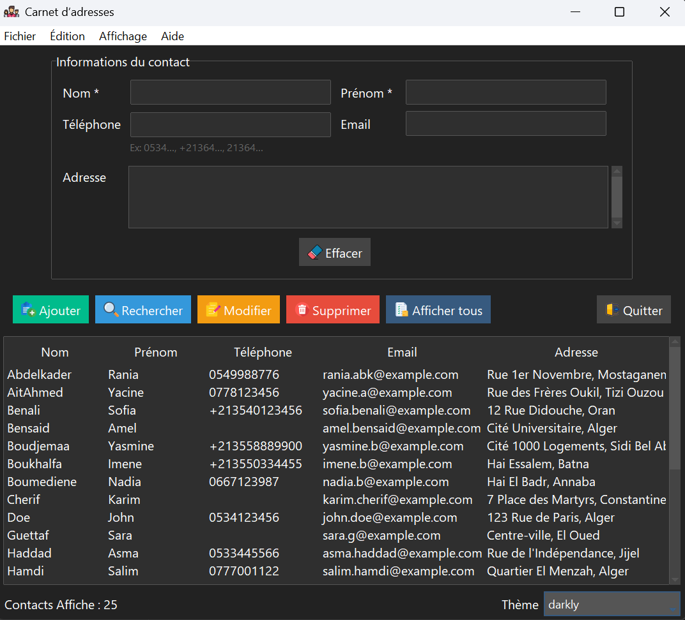
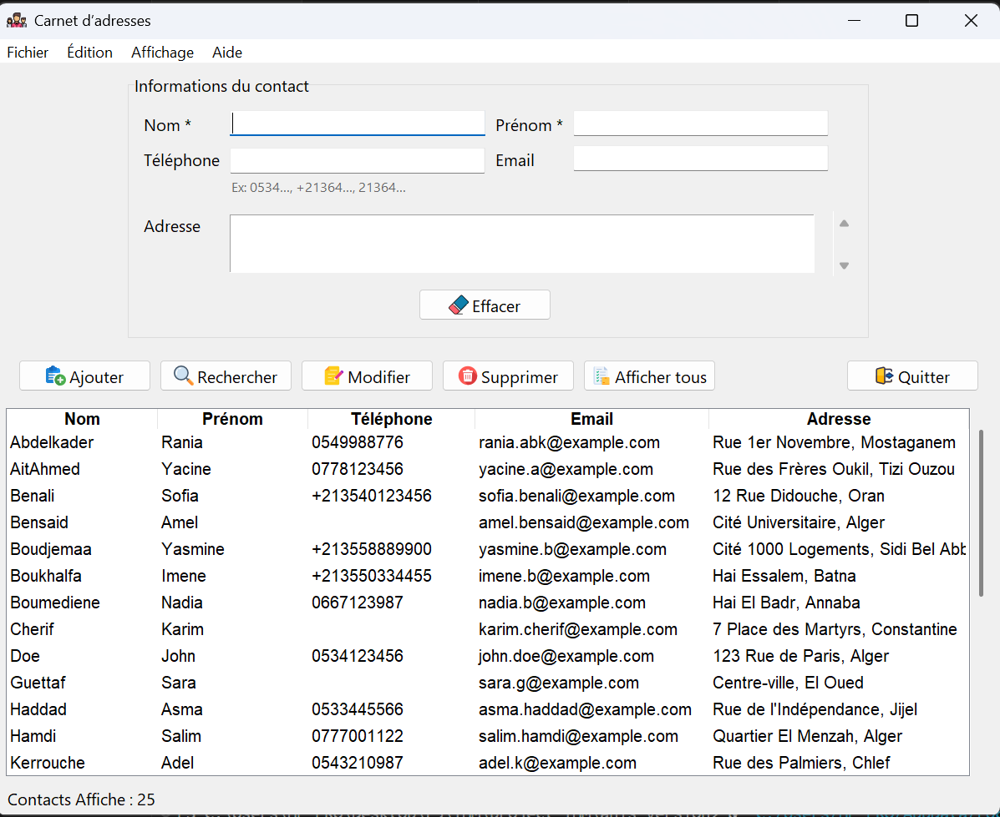

# Carnet d'adresses - Application de gestion de contacts

Application bureautique de gestion de contacts personnels et professionnels (carnet d'adresses) développée en Python avec une architecture MVC.

## Description

Cette application permet de gérer efficacement vos contacts grâce à une interface intuitive. Elle offre toutes les opérations CRUD (Créer, Lire, Modifier, Supprimer).

## Fonctionnalités

- **Ajouter un contact** : Saisie des informations (nom, prénom, téléphone, email, adresse)
- **Rechercher** : Recherche avec correspondance partielle sur nom, téléphone ou email
- **Modifier** : Mise à jour facile des informations d'un contact
- **Supprimer** : Suppression avec confirmation
- **Afficher tous** : Liste triée alphabétiquement par nom
- **Interface moderne** : Thèmes clair/sombre personnalisables
- **Raccourcis clavier** : Pour les utilisateurs avancés

## Technologies utilisées

- **Python 3.14.0** - Langage principal
- **Tkinter** - Interface graphique standard
- **ttkbootstrap** - Thèmes modernes (optionnel)
- **SQLite3** - Base de données locale
- **Architecture MVC** - Séparation claire des responsabilités

## Aperçu de l'interface

### Interface avec ttkbootstrap (thèmes modernes)

| Thème solar | Thème darkly |
|:---:|:---:|
|  |  |

### Interface Tkinter classique (sans ttkbootstrap)

*L'application détecte automatiquement si ttkbootstrap est installé*

